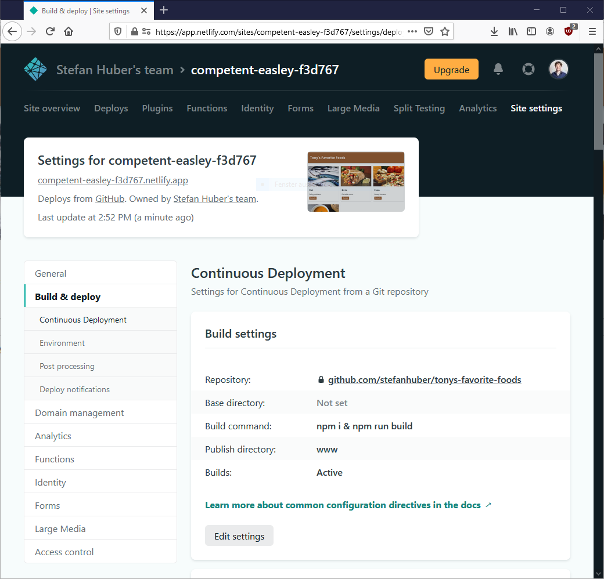
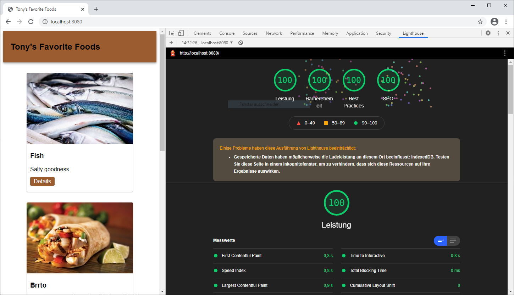

# Tony's Favorite Foods

## Netlify Projekt Setup

 - Es ist ein Repository auf Github zu erstellen, in dem sich das Projekt befinden soll
 - Ebenfalls soll mit Github ein Account bei Netlify erstellt werden und das Projekt soll mit Netlify verbunden werden
 - Das Netlify Projekt soll so eingerichtet werden, dass der Ordner `www` veröffentlicht wird und das ein Build durchgeführt wird `npm i & npm run build`, vergleiche die Deployment Einstellungen unten
 - Das Projekt soll über die von Netlify generierte URL zugänglich sein

## Lokales Projekt Setup

 - Starten Sie lokal einen Webserver `npm start`
 - Führen Sie lokal den Buildprozess aus: `npm run build`
 - Öffnen Sie das Projekt auf `http://localhost:8080`

## Ziel

## Vorgehen

 - Prüfen ob und welches Javascript wichtig ist für die Website ist und gegebenenfalls eliminieren oder umschreiben:
    - Coverage Tool von Chrome
    - Network Request Blocking   
 - Build Pipeline optimieren:
    - Bilder komprimieren ([sharp](https://www.npmjs.com/package/sharp))
    - CSS Minification ([csso](https://www.npmjs.com/package/csso))
    - JS Minification ([terser](https://www.npmjs.com/package/terser))
 - Layoutshifts eliminieren
 - SEO und Best Practices Check

## Abgabe

Link auf Netlify Website muss über Moodle abgegeben werden
- https://pensive-goldstine-c1b4af.netlify.app/
